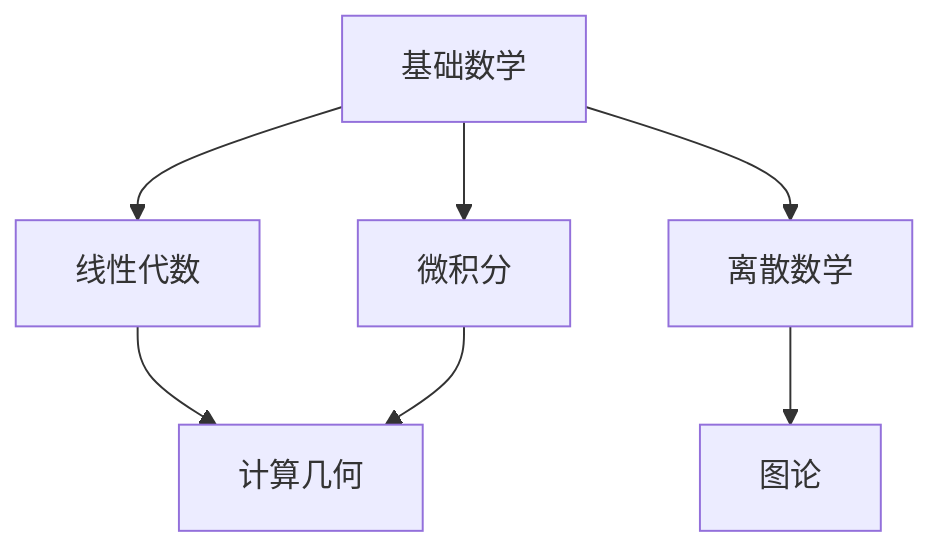

# 基础数学概要

基础数学是计算机图形学和几何处理的理论基石，为高级算法和应用提供必要的数学工具和理论支撑。

## 1. 知识体系

### 1.1 集合论与逻辑

- **集合基础**
  - 集合运算
  - 映射与函数
  - 关系理论
- **数理逻辑**
  - 命题逻辑
  - 谓词逻辑
  - 数学证明方法

### 1.2 度量空间

- **距离与度量**
  - 度量的定义与公理
  - 常见距离度量
    - 欧氏距离
    - 曼哈顿距离
    - Hausdorff 距离
    - Fréchet 距离
- **度量空间性质**
  - 收敛性
  - 完备性
  - 紧致性

### 1.3 代数结构

- **群论基础**
  - 群的定义
  - 子群
  - 同态与同构
- **环与域**
  - 整环
  - 域的性质
  - 有限域

### 1.4 拓扑学基础

- **拓扑空间**
  - 开集与闭集
  - 连续性
  - 紧致性
- **同胚与不变量**
  - 拓扑不变量
  - 基本群
  - 同伦论基础

## 2. 在图形学中的应用

### 2.1 基础工具

- 集合运算用于布尔操作
- 度量空间用于相似度计算
- 拓扑学用于曲面分析

### 2.2 高级应用

- 形状分析与匹配
- 曲面参数化
- 网格处理算法

## 3. 学习路径建议

### 3.1 基础阶段

1. 集合论与逻辑 → 打好严格思维基础
2. 度量空间 → 理解距离和相似性
3. 代数结构 → 掌握抽象代数工具

### 3.2 进阶阶段

1. 拓扑学基础 → 理解形状的本质
2. 高等代数 → 深入代数结构
3. 应用实践 → 结合具体问题

## 4. 与其他数学分支的关系

## 5. 重要性说明

基础数学在图形学中的重要性体现在：

1. **理论基础**

   - 提供严格的数学语言
   - 建立抽象思维框架
   - 保证算法的正确性

2. **工具支持**

   - 提供基本的数学工具
   - 支持算法设计和分析
   - 辅助问题形式化

3. **应用指导**
   - 指导算法优化
   - 帮助理解问题本质
   - 启发解决方案设计

## 6. 学习建议

1. **循序渐进**

   - 从基础概念开始
   - 注重理解本质
   - 多做练习和应用

2. **联系实践**

   - 结合具体问题
   - 实现相关算法
   - 分析实际案例

3. **建立联系**
   - 横向关联各数学分支
   - 纵向深入理解原理
   - 注重知识整合

## 7. 参考资源

### 7.1 经典教材

- 《数学分析》
- 《抽象代数》
- 《基础拓扑学》

### 7.2 在线资源

- MIT OpenCourseWare
- 3Blue1Brown 视频系列
- Mathematics Stack Exchange

## 8. 后续发展

基础数学的学习将为以下方向打下基础：

1. **理论研究**

   - 算法设计与分析
   - 数学模型构建
   - 理论创新

2. **工程应用**

   - 图形渲染
   - 几何处理
   - 物理模拟

3. **交叉领域**
   - 计算机视觉
   - 机器学习
   - 科学计算
