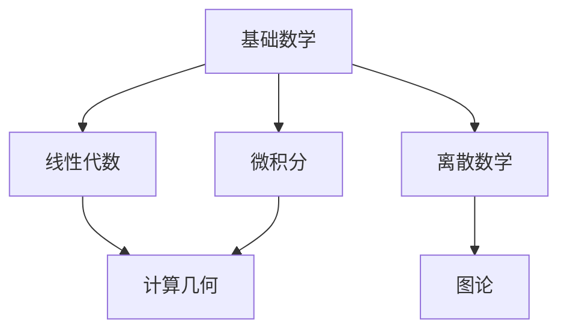

[![Contributors][contributors-shield]][contributors-url]
[![Forks][forks-shield]][forks-url]
[![Stargazers][stars-shield]][stars-url]
[![Issues][issues-shield]][issues-url]
[][license-url]

<!-- PROJECT LOGO -->
 

  

  

    <a href="https://ng-tech.icu/books/Mathematics-Notes"><strong>在线阅读 >> </strong></a>
     
     
    <a href="https://github.com/wx-chevalier">代码案例</a>
    ·
       <a href="https://github.com/wx-chevalier/Awesome-Lists">参考资料</a>

  

<!-- ABOUT THE PROJECT -->

# 现代数学体系

- **数学基础**

  - 数理逻辑
    - 命题逻辑与谓词逻辑
    - 证明论与模型论
    - 递归论与可计算性
  - 集合论
    - 朴素集合论（集合运算、映射、关系）
    - 公理化集合论（ZFC 公理系统）
    - 序理论与基数理论
  - 范畴论
    - 范畴与函子
    - 自然变换
    - 范畴论在数学中的统一作用

- **代数系统**

  - 初等代数
    - 数系理论
    - 多项式理论
    - 方程理论
  - 抽象代数
    - 群论（群、子群、商群、同态）
    - 环论（环、理想、商环）
    - 域论（域扩张、伽罗瓦理论）
  - 线性代数
    - 向量空间理论
    - 线性变换与矩阵论
    - 特征值理论
  - 高等代数
    - 模论
    - 李代数
    - 表示论

- **分析系统**

  - 经典分析
    - 实分析（极限、连续、微积分）
    - 复分析（解析函数、复积分）
    - 测度论（勒贝格积分）
  - 现代分析
    - 泛函分析（赋范空间、希尔伯特空间）
    - 调和分析（傅里叶分析、小波分析）
    - 算子理论
  - 微分方程
    - 常微分方程
    - 偏微分方程
    - 动力系统理论

- **几何系统**

  - 经典几何
    - 欧氏几何
    - 射影几何
    - 仿射几何
  - 现代几何
    - 微分几何（流形论、黎曼几何）
    - 代数几何（代数簇、层论）
    - 辛几何与泊松几何
  - 拓扑学
    - 点集拓扑（拓扑空间、连续性）
    - 代数拓扑（同伦论、同调论）
    - 微分拓扑（光滑流形）

- **应用数学**

  - 概率与统计
    - 概率论（概率空间、随机过程）
    - 数理统计（统计推断、回归分析）
    - 随机分析
  - 计算数学
    - 数值分析
    - 最优化理论
    - 计算机代数
  - 离散数学
    - 组合数学
    - 图论
    - 编码理论

- **数学物理**

  - 经典力学
    - 变分法
    - 哈密顿系统
  - 量子理论
    - 量子力学数学基础
    - 量子场论
  - 相对论
    - 时空几何
    - 广义相对论数学基础

- **现代交叉领域**

  - 数学与计算机科学
    - 计算复杂性理论
    - 算法分析
    - 形式语言与自动机
  - 数学与人工智能
    - 机器学习的数学基础
    - 神经网络理论
    - 统计学习理论
  - 数学与生物学
    - 生物数学模型
    - 群体动力学
    - 生物信息学

- **数学思想方法**

  - 抽象化方法
    - 结构抽象
    - 公理化思维
    - 模型构建
  - 统一化思想
    - 不变量理论
    - 普遍性原理
    - 对偶性原理
  - 算法化思维
    - 构造性方法
    - 计算复杂性
    - 近似算法

- **数学研究特点**
  - 理论深度
    - 本质探索
    - 结构研究
    - 统一理论构建
  - 应用广度
    - 跨学科应用
    - 工具方法创新
    - 实际问题解决
  - 发展动态
    - 分支交叉融合
    - 新兴领域产生
    - 计算工具革新

# Nav | 关联导航

# About | 关于

<!-- CONTRIBUTING -->

## Contributing

Contributions are what make the open source community such an amazing place to be learn, inspire, and create. Any contributions you make are **greatly appreciated**.

1. Fork the Project
2. Create your Feature Branch (`git checkout -b feature/AmazingFeature`)
3. Commit your Changes (`git commit -m 'Add some AmazingFeature'`)
4. Push to the Branch (`git push origin feature/AmazingFeature`)
5. Open a Pull Request

<!-- ACKNOWLEDGEMENTS -->

## Acknowledgements

- [Awesome-Lists](https://github.com/wx-chevalier/Awesome-Lists): 📚 Guide to Galaxy, curated, worthy and up-to-date links/reading list for ITCS-Coding/Algorithm/SoftwareArchitecture/AI. 💫 ITCS-编程/算法/软件架构/人工智能等领域的文章/书籍/资料/项目链接精选。

- [Awesome-CS-Books](https://github.com/wx-chevalier/Awesome-CS-Books): :books: Awesome CS Books/Series(.pdf by git lfs) Warehouse for Geeks, ProgrammingLanguage, SoftwareEngineering, Web, AI, ServerSideApplication, Infrastructure, FE etc. :dizzy: 优秀计算机科学与技术领域相关的书籍归档。

## Copyright & More | 延伸阅读

笔者所有文章遵循[知识共享 署名 - 非商业性使用 - 禁止演绎 4.0 国际许可协议](https://creativecommons.org/licenses/by-nc-nd/4.0/deed.zh)，欢迎转载，尊重版权。您还可以前往 [NGTE Books](https://ng-tech.icu/books-gallery/) 主页浏览包含知识体系、编程语言、软件工程、模式与架构、Web 与大前端、服务端开发实践与工程架构、分布式基础架构、人工智能与深度学习、产品运营与创业等多类目的书籍列表：

# Links

<!-- MARKDOWN LINKS & IMAGES -->
<!-- https://www.markdownguide.org/basic-syntax/#reference-style-links -->

[contributors-shield]: https://img.shields.io/github/contributors/wx-chevalier/Mathematics-Notes.svg?style=flat-square
[contributors-url]: https://github.com/wx-chevalier/Mathematics-Notes/graphs/contributors
[forks-shield]: https://img.shields.io/github/forks/wx-chevalier/Mathematics-Notes.svg?style=flat-square
[forks-url]: https://github.com/wx-chevalier/Mathematics-Notes/network/members
[stars-shield]: https://img.shields.io/github/stars/wx-chevalier/Mathematics-Notes.svg?style=flat-square
[stars-url]: https://github.com/wx-chevalier/Mathematics-Notes/stargazers
[issues-shield]: https://img.shields.io/github/issues/wx-chevalier/Mathematics-Notes.svg?style=flat-square
[issues-url]: https://github.com/wx-chevalier/Mathematics-Notes/issues
[license-shield]: https://img.shields.io/github/license/wx-chevalier/Mathematics-Notes.svg?style=flat-square
[license-url]: https://github.com/wx-chevalier/Mathematics-Notes/blob/master/LICENSE.txt
