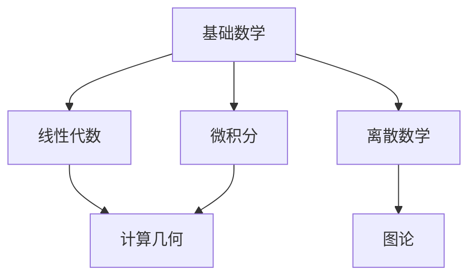

[![Contributors][contributors-shield]][contributors-url]
[![Forks][forks-shield]][forks-url]
[![Stargazers][stars-shield]][stars-url]
[![Issues][issues-shield]][issues-url]
[][license-url]

<!-- PROJECT LOGO -->
 

  

  

    <a href="https://ng-tech.icu/books/Mathematics-Notes"><strong>在线阅读 >> </strong></a>
     
     
    <a href="https://github.com/wx-chevalier">代码案例</a>
    ·
       <a href="https://github.com/wx-chevalier/Awesome-Lists">参考资料</a>

  

<!-- ABOUT THE PROJECT -->

# 现代数学体系

# 应用数学知识体系

## 第一部分：数学基础

### 1. 数理逻辑

#### 1.1 命题逻辑

- 基本命题与联结词
- 真值表与逻辑等价
- 推理规则与演算
- 范式与化简
- 可满足性问题

#### 1.2 谓词逻辑

- 量词与谓词
- 谓词公式
- 推理系统
- 一阶逻辑
- 可判定性

#### 1.3 数学证明

- 直接证明法
- 反证法
- 数学归纳法
- 构造性证明
- 算法正确性证明

### 2. 集合论基础

#### 2.1 集合运算

- 集合的表示方法
- 并差交补运算
- 笛卡尔积
- 幂集
- 集合代数定律

#### 2.2 关系

- 二元关系
- 等价关系
- 偏序关系
- 良序关系
- 关系的性质

#### 2.3 映射

- 映射的定义
- 单射与满射
- 双射与逆映射
- 复合映射
- 映射的应用

### 3. 离散数学

#### 3.1 组合数学

- 加法与乘法原理
- 排列与组合
- 二项式定理
- 生成函数
- 递推关系

#### 3.2 图论基础

- 图的基本概念
- 路径与回路
- 树与生成树
- 图的遍历
- 最短路径
- 网络流
- 图着色问题

#### 3.3 代数结构

- 群的概念
- 环与域
- 同态与同构
- 置换群
- 编码理论基础

## 第二部分：线性代数

### 1. 向量空间

#### 1.1 向量运算

- 向量的代数运算
- 线性组合
- 内积与范数
- 正交性与正交化
- 向量空间的度量

#### 1.2 线性相关性

- 线性相关与无关
- 向量组的秩
- 基与维数
- 坐标系统
- 基变换

#### 1.3 子空间理论

- 子空间的定义
- 生成子空间
- 直和与补空间
- 正交补
- 商空间

### 2. 矩阵理论

#### 2.1 矩阵运算

- 矩阵的代数运算
- 分块矩阵
- 矩阵乘法
- 转置与逆矩阵
- 初等变换

#### 2.2 特殊矩阵

- 对称矩阵
- 正交矩阵
- 正定矩阵
- 稀疏矩阵
- 随机矩阵
- Toeplitz 矩阵
- 循环矩阵

#### 2.3 行列式

- 行列式的定义
- 行列式的性质
- 行列式的计算
- 克莱姆法则
- 行列式的应用

### 3. 矩阵分解与应用

#### 3.1 基本分解

- 特征值分解
- 奇异值分解(SVD)
- LU 分解
- QR 分解
- Cholesky 分解

#### 3.2 应用型分解

- 主成分分析(PCA)
- 非负矩阵分解(NMF)
- 因子分析
- 张量分解
- 谱聚类

#### 3.3 矩阵近似

- 低秩近似
- 矩阵补全
- 压缩感知
- 稀疏表示
- 字典学习

### 4. 线性变换

#### 4.1 基本理论

- 线性变换的定义
- 矩阵表示
- 核空间与像空间
- 秩-零化度定理
- 特征空间分解

#### 4.2 几何变换

- 旋转变换
- 缩放变换
- 剪切变换
- 投影变换
- 仿射变换

#### 4.3 应用

- 线性系统求解
- 最小二乘问题
- 线性回归
- 线性分类
- 降维技术
- 核方法

## 第三部分：微积分与分析

### 1. 函数与极限

#### 1.1 函数基础

- 函数的概念
- 初等函数
- 复合函数
- 反函数
- 隐函数
- 参数方程

#### 1.2 极限理论

- 数列极限
- 函数极限
- ε-δ 语言
- 极限运算法则
- 夹逼准则
- 单调有界准则

#### 1.3 连续性

- 连续性定义
- 间断点分类
- 连续函数性质
- 一致连续
- 紧集上的连续性
- Lipschitz 连续

### 2. 微分学

#### 2.1 导数基础

- 导数定义
- 求导法则
- 高阶导数
- 隐函数求导
- 参数方程求导
- 方向导数

#### 2.2 偏导数

- 偏导数定义
- 全微分
- 链式法则
- 隐函数定理
- 雅可比矩阵
- Hessian 矩阵

#### 2.3 微分应用

- 函数极值
- 泰勒展开
- 拉格朗日乘子法
- 梯度下降
- 牛顿法
- 最速下降法

### 3. 积分学

#### 3.1 不定积分

- 原函数概念
- 基本积分公式
- 换元积分法
- 分部积分法
- 有理函数积分
- 三角函数积分

#### 3.2 定积分

- Riemann 积分
- Newton-Leibniz 公式
- 定积分性质
- 反常积分
- 数值积分方法
- 积分应用

#### 3.3 重积分

- 二重积分
- 三重积分
- 曲线积分
- 曲面积分
- Green 公式
- Stokes 公式
- Gauss 公式

### 4. 级数与变换

#### 4.1 数项级数

- 级数收敛性
- 正项级数
- 交错级数
- 绝对收敛
- 条件收敛
- 级数审敛法

#### 4.2 函数项级数

- 幂级数
- Taylor 级数
- Fourier 级数
- 一致收敛性
- 函数空间
- 正交系统

#### 4.3 积分变换

- Fourier 变换
- Laplace 变换
- Z 变换
- 小波变换
- 变换性质
- 卷积定理

## 第四部分：概率论与统计

### 1. 概率论基础

#### 1.1 概率空间

- 样本空间
- 事件域
- 概率测度
- 概率公理
- 条件概率
- 全概率公式
- Bayes 公式

#### 1.2 随机变量

- 离散随机变量
- 连续随机变量
- 分布函数
- 密度函数
- 数字特征
- 特征函数
- 矩母函数

#### 1.3 多维随机变量

- 联合分布
- 边缘分布
- 条件分布
- 独立性
- 相关系数
- Copula 函数
- 多维变换

### 2. 概率分布与模型

#### 2.1 离散分布

- 伯努利分布
- 二项分布
- 泊松分布
- 几何分布
- 负二项分布
- 超几何分布
- 多项分布

#### 2.2 连续分布

- 均匀分布
- 正态分布
- 指数分布
- Gamma 分布
- Beta 分布
- t 分布
- F 分布
- χ² 分布

#### 2.3 概率模型

- 多元正态分布
- 混合模型
- 指数族分布
- 共轭先验
- 隐马尔可夫模型
- 贝叶斯网络
- 图模型

### 3. 统计推断

#### 3.1 抽样理论

- 简单随机抽样
- 统计量
- 抽样分布
- 中心极限定理
- 大数定律
- Bootstrap 方法
- 经验分布

#### 3.2 参数估计

- 点估计
- 区间估计
- 最大似然估计
- 最大后验估计
- 矩估计
- 贝叶斯估计
- EM 算法
- MCMC 方法

#### 3.3 假设检验

- 显著性检验
- 功效分析
- 参数检验
- t 检验
- χ² 检验
- 方差分析
- 多重检验
- 非参数检验

### 4. 统计建模

#### 4.1 回归分析

- 线性回归
- 多元回归
- 广义线性模型
- 非线性回归
- 岭回归
- Lasso 回归
- 主成分回归
- 稳健回归

#### 4.2 时间序列

- 平稳过程
- 自相关函数
- AR 模型
- MA 模型
- ARMA 模型
- ARIMA 模型
- GARCH 模型
- 状态空间模型

## 第五部分：最优化理论

### 1. 最优化基础

#### 1.1 问题形式

- 目标函数
- 约束条件
- 可行域
- 局部最优
- 全局最优
- 凸优化问题
- 非凸优化

#### 1.2 优化理论

- 凸集
- 凸函数
- 次梯度
- KKT 条件
- 对偶理论
- 鞍点理论
- 变分法

#### 1.3 优化模型

- 线性规划
- 二次规划
- 整数规划
- 非线性规划
- 半定规划
- 多目标优化
- 随机优化

### 2. 无约束优化

#### 2.1 一阶方法

- 梯度下降法
- 最速下降法
- 随机梯度下降
- 动量法
- AdaGrad
- RMSprop
- Adam 算法
- 自适应学习率

#### 2.2 二阶方法

- 牛顿法
- 拟牛顿法
- BFGS 算法
- L-BFGS 算法
- 共轭梯度法
- 信赖域方法
- 拟牛顿-CG 混合

#### 2.3 直接搜索

- 网格搜索
- 单纯形法
- 模式搜索
- 遗传算法
- 粒子群优化
- 模拟退火
- 差分进化

### 3. 约束优化

#### 3.1 等式约束

- 拉格朗日乘子法
- 罚函数法
- 增广拉格朗日法
- 内点法
- 序列二次规划
- 可行方向法
- 障碍函数法

#### 3.2 不等式约束

- 主动集方法
- 投影梯度法
- 切平面法
- 椭球法
- 内点法变体
- 外点法
- 精确惩罚函数

#### 3.3 特殊约束

- 边界约束
- 线性约束
- 二次约束
- 锥约束
- 半定约束
- 整数约束
- 组合约束

### 4. 优化应用

#### 4.1 机器学习优化

- 损失函数设计
- 正则化优化
- 稀疏优化
- 在线学习
- 分布式优化
- 随机优化
- 对抗优化

#### 4.2 工程应用

- 最优控制
- 轨迹规划
- 资源分配
- 网络优化
- 投资组合
- 调度问题
- 设计优化

## 第六部分：数值计算方法

### 1. 数值代数

#### 1.1 线性方程组

- 高斯消元法
- LU 分解求解
- Cholesky 分解
- 迭代法基础
- Jacobi 迭代
- Gauss-Seidel 迭代
- SOR 方法
- 共轭梯度法

#### 1.2 特征值计算

- 幂法
- 反幂法
- QR 算法
- Lanczos 算法
- Arnoldi 算法
- Jacobi 方法
- 双边 Lanczos
- 隐式重启

#### 1.3 矩阵计算

- 矩阵范数
- 条件数
- 病态问题
- 预处理技术
- 稀疏矩阵存储
- 并行计算基础
- 误差分析
- 数值稳定性

### 2. 插值与逼近

#### 2.1 插值方法

- 拉格朗日插值
- 牛顿插值
- Hermite 插值
- 分段线性插值
- 三次样条插值
- B 样条
- 三角插值
- 多维插值

#### 2.2 函数逼近

- 最小二乘法
- 正交多项式
- Chebyshev 多项式
- Legendre 多项式
- 傅里叶逼近
- 有理函数逼近
- Padé 逼近
- 小波逼近

#### 2.3 数值微分

- 差分公式
- Richardson 外推
- 自动微分
- 符号微分
- 高阶导数
- 偏导数计算
- 梯度计算
- Hessian 计算

### 3. 数值积分

#### 3.1 一维积分

- 梯形法则
- Simpson 法则
- Newton-Cotes 公式
- Gauss 求积
- Romberg 积分
- 自适应积分
- 奇异积分
- 振荡积分

#### 3.2 多维积分

- 重积分计算
- Monte Carlo 方法
- 准 Monte Carlo
- 重要性采样
- 拒绝采样
- Metropolis 算法
- Gibbs 采样
- 数值路径积分

### 4. 微分方程数值解

#### 4.1 常微分方程

- Euler 方法
- Runge-Kutta 方法
- 多步法
- Adams 方法
- 预测校正法
- 刚性问题
- 边值问题
- 打靶法

#### 4.2 偏微分方程

- 有限差分法
- 有限元法
- 有限体积法
- 谱方法
- 边界元法
- 特征线法
- 交替方向法
- 多重网格法

### 5. 优化算法实现

#### 5.1 数值优化基础

- 线搜索方法
- Wolfe 条件
- Armijo 准则
- 步长选择
- 收敛性分析
- 数值精度
- 停止准则
- 全局化策略

#### 5.2 实践技巧

- 参数调优
- 数值稳定性
- 计算效率
- 内存管理
- 并行计算
- GPU 加速
- 自动微分
- 混合精度计算

# Nav | 关联导航

# About | 关于

<!-- CONTRIBUTING -->

## Contributing

Contributions are what make the open source community such an amazing place to be learn, inspire, and create. Any contributions you make are **greatly appreciated**.

1. Fork the Project
2. Create your Feature Branch (`git checkout -b feature/AmazingFeature`)
3. Commit your Changes (`git commit -m 'Add some AmazingFeature'`)
4. Push to the Branch (`git push origin feature/AmazingFeature`)
5. Open a Pull Request

<!-- ACKNOWLEDGEMENTS -->

## Acknowledgements

- [Awesome-Lists](https://github.com/wx-chevalier/Awesome-Lists): 📚 Guide to Galaxy, curated, worthy and up-to-date links/reading list for ITCS-Coding/Algorithm/SoftwareArchitecture/AI. 💫 ITCS-编程/算法/软件架构/人工智能等领域的文章/书籍/资料/项目链接精选。

- [Awesome-CS-Books](https://github.com/wx-chevalier/Awesome-CS-Books): :books: Awesome CS Books/Series(.pdf by git lfs) Warehouse for Geeks, ProgrammingLanguage, SoftwareEngineering, Web, AI, ServerSideApplication, Infrastructure, FE etc. :dizzy: 优秀计算机科学与技术领域相关的书籍归档。

## Copyright & More | 延伸阅读

笔者所有文章遵循[知识共享 署名 - 非商业性使用 - 禁止演绎 4.0 国际许可协议](https://creativecommons.org/licenses/by-nc-nd/4.0/deed.zh)，欢迎转载，尊重版权。您还可以前往 [NGTE Books](https://ng-tech.icu/books-gallery/) 主页浏览包含知识体系、编程语言、软件工程、模式与架构、Web 与大前端、服务端开发实践与工程架构、分布式基础架构、人工智能与深度学习、产品运营与创业等多类目的书籍列表：

# Links

<!-- MARKDOWN LINKS & IMAGES -->
<!-- https://www.markdownguide.org/basic-syntax/#reference-style-links -->

[contributors-shield]: https://img.shields.io/github/contributors/wx-chevalier/Mathematics-Notes.svg?style=flat-square
[contributors-url]: https://github.com/wx-chevalier/Mathematics-Notes/graphs/contributors
[forks-shield]: https://img.shields.io/github/forks/wx-chevalier/Mathematics-Notes.svg?style=flat-square
[forks-url]: https://github.com/wx-chevalier/Mathematics-Notes/network/members
[stars-shield]: https://img.shields.io/github/stars/wx-chevalier/Mathematics-Notes.svg?style=flat-square
[stars-url]: https://github.com/wx-chevalier/Mathematics-Notes/stargazers
[issues-shield]: https://img.shields.io/github/issues/wx-chevalier/Mathematics-Notes.svg?style=flat-square
[issues-url]: https://github.com/wx-chevalier/Mathematics-Notes/issues
[license-shield]: https://img.shields.io/github/license/wx-chevalier/Mathematics-Notes.svg?style=flat-square
[license-url]: https://github.com/wx-chevalier/Mathematics-Notes/blob/master/LICENSE.txt
